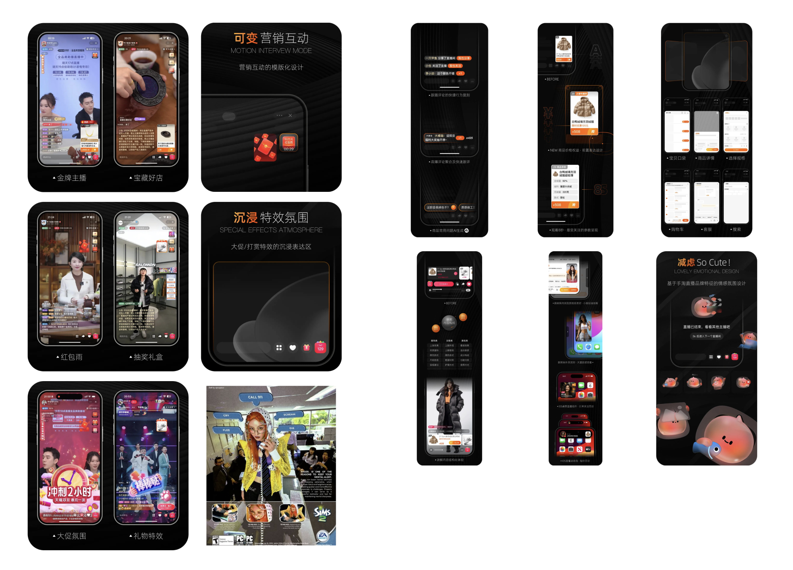
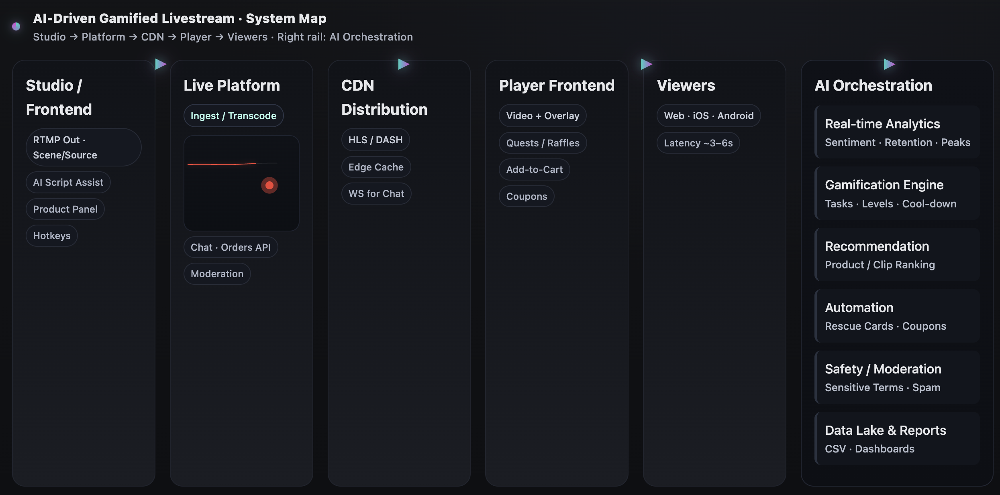
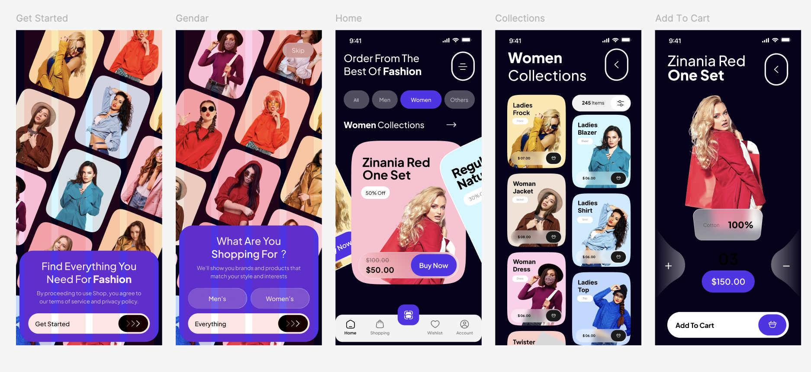

# Project Progress – AI-Driven Gamified E-commerce Livestreaming
_Date:_ 2025-10-19

## Recent Progress

Recently I consolidated the research foundation, fixed the methodology, finalized the system map, initiated a dark-theme backend demo for downturn recovery, and set up a minimal chat-data pipeline for analysis. 

- Completed literature review on social commerce, livestream interaction, gamification effects, and real-time analytics.
- Finalised research design: Quant (surveys + funnel/retention), Netnography (live-room observation), Phenomenology (viewer/host experience).
- Drafted and aligned the **system map** for the service.
- Started the **backend (dark) demo** to visualise KPI decline and recovery actions.
- Set up a minimal data pipeline for live chat capture and cleaning (for later mock/analysis).

I also collected references for style and functional patterns from the biggest chinese e-commerce platform which I felt quite helpful.

## System Map

High-level flow: **Studio/Frontend → Live Platform → CDN → Player → Viewers**, with a vertical **AI Orchestration** layer (analytics, gamification engine, recommendation, automation, safety, reporting).

## Backend Demo (current)

- KPI cards (GMV, Orders, Viewers, Conversion Rate, Avg Watch Time)
- Red alert bar for downturns
- **Clicks & Purchases** decline animation (≈5–6s)
- **Recovery Actions** panel (Q&A sprint, −5% coupon, pin demo clip)
- Traffic source donut + rolling comments (mock)

## AI Participation (code and training)

- Set up a minimal data pipeline for chat capture and cleaning to CSV for downstream modelling.  
  [Chat capture](./douyin_live_chat_to_csv.py)
- Prepared training scripts for multi-task text classification on cleaned chat:
  - `ai/data_prep.py` — builds `data/train.csv` and `data/test.csv` from cleaned chat and optional labels.
  - `ai/train_multitask.py` — fine-tunes a lightweight multilingual transformer with three heads: sentiment, buy-intent, topic.
  - `ai/realtime_infer.py` — inference scaffold for tagging incoming chat and emitting action signals.
- Model outputs to drive orchestration:
  - Sentiment and frustration flags
  - Buy-intent score
  - Topic tags (price, size, delivery, restock, quality, link, other)
  - Simple downturn detection over short time windows

## Mobile UI/UX (phone)

- Core flows: Home, Live Player, Overlay HUD, Rewards Wallet, Cart, Orders.
- Dark theme components:
  - Overlay HUD for quests, coupons, pinned clip prompts
  - Bottom sheet for Q&A and quick add-to-cart
- Initial scaffold (e.g., React Native/Expo):
  - `mobile/App.tsx` — navigation and dark theme
  - `mobile/components/OverlayHUD.tsx` — quests, timer, coupon chips

## Next Steps (for service demo)

- Finalise the service blueprint (roles, flows, touchpoints, handoffs).
- Connect backend decline detection to rule/ML triggers and visible actions in the demo.
- Label a small seed set for the model and run first training; integrate `realtime_infer` into the backend.
- Define operational metrics for the demo: retention, interaction density, add-to-cart CTR, checkout clicks.
- Prepare user test protocol and an ethics note (data scope, anonymisation, user agency).
